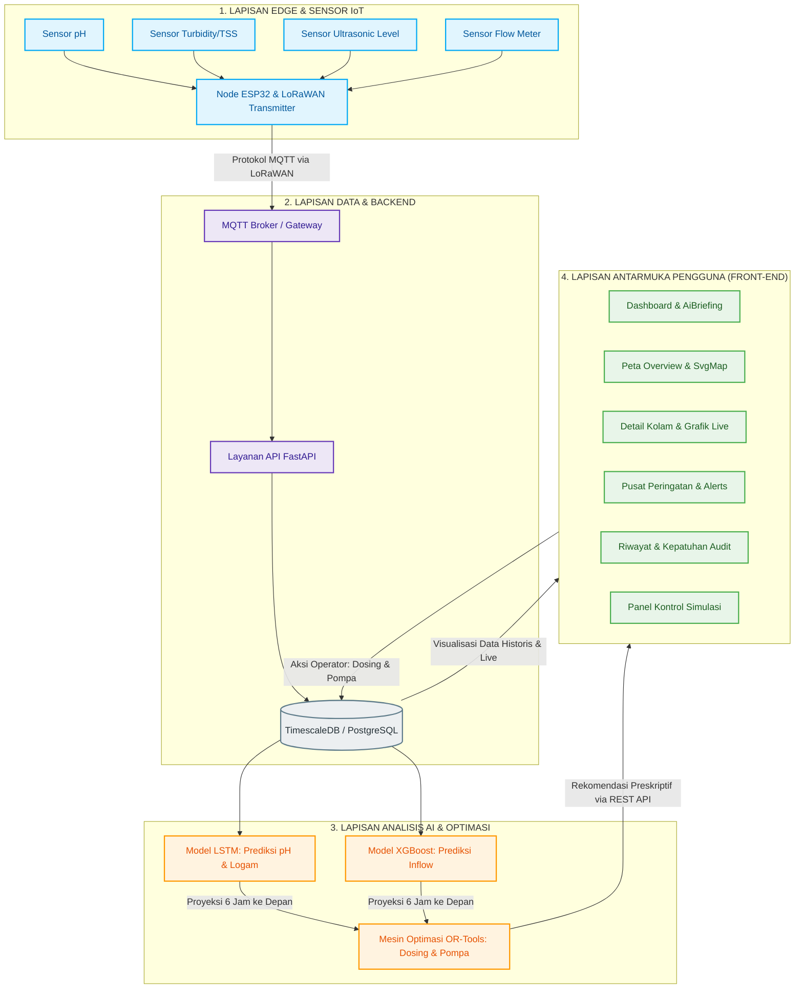

# KidecoWater - Sistem Prediktif & Preskriptif Pengelolaan Air Asam Tambang (AAT)

KidecoWater adalah prototipe aplikasi web terintegrasi berbasis **AI (Kecerdasan Buatan)** dan **IoT (Internet of Things)** yang dirancang untuk memantau, memprediksi, dan mengendalikan kualitas serta level air asam tambang (AAT) di kolam pengendapan (_settling pond_) PT Kideco Jaya Agung secara _real-time_.

Proyek ini dibuat untuk menjawab tantangan pengelolaan lingkungan yang reaktif pada tambang batu bara terbuka, dengan mengubahnya menjadi keputusan yang prediktif dan preskriptif, guna memenuhi standar baku mutu nasional (**KepMenLH No. 113 Tahun 2003**) dan mendukung kesiapan operasional menghadapi La Niña.

---

## 🏛️ Arsitektur Sistem

Berikut adalah arsitektur aliran data terintegrasi dari sensor IoT di lapangan menuju model prediksi AI, hingga antarmuka pengguna:



---

## 🌟 Fitur Utama

1.  **Monitoring IoT Terpusat**: Visualisasi real-time parameter pH, TSS (turbidity), level air kolam, koordinat kolam, dan debit aliran (_inflow/outflow_) melalui Peta Overview spasial dan panel instrumen.
2.  **Prakiraan AI 6 Jam ke Depan**: Memprediksi risiko luapan (_overflow_) dan penurunan pH akibat curah hujan tinggi menggunakan model machine learning (LSTM dan XGBoost).
3.  **Mesin Rekomendasi Preskriptif (AI)**: Menyarankan tindakan penanganan paling efisien:
    - **Dosing Kapur Presisi**: Menghitung berat kapur optimal (kg) untuk menaikkan pH ke zona aman tanpa terjadi pemborosan reagen.
    - **Jadwal Pompa Otomatis**: Menyusun jadwal pemompaan antar-kolam guna mendistribusikan kelebihan air dari kolam kritis.
4.  **Simulasi Sandbox Interaktif**: Panel kendali melayang di sisi kanan bawah untuk menguji skenario cuaca ekstrem BMKG (La Niña), memicu dosing kapur secara gradual, dan mengoperasikan sakelar pompa hidrolik secara langsung.
5.  **Log Audit Kepatuhan & Ekspor**: Pencatatan otomatis riwayat kualitas air dan keputusan operator untuk kriteria penilaian peringkat **PROPER** LHK, lengkap dengan opsi ekspor laporan ke format `.CSV`.

---

## 🛠️ Tumpukan Teknologi (Tech Stack)

- **Core**: HTML5, JavaScript (React 18.3)
- **Build Tool**: Vite 5.4
- **Styling**: Vanilla CSS dengan Sistem Token Terpusat (`src/styles/tokens.css`)
- **Grafik**: Recharts (Visualisasi tren deret waktu dinamis)
- **Navigasi**: React Router DOM 6.26
- **Mesin Simulasi**: JavaScript-based client-side hydrology and chemical kinetics engine

---

## ⚙️ Cara Menjalankan Proyek Secara Lokal

### Prasyarat

Pastikan komputer Anda sudah terinstal **Node.js** (versi 18 atau lebih baru) dan npm.

### Langkah Instalasi

1.  **Kloning atau Salin Repositori** ke direktori lokal Anda.
2.  Buka terminal/command prompt di direktori proyek dan instal dependensi:
    ```bash
    npm install
    ```
3.  Jalankan server pengembangan lokal:
    ```bash
    npm run dev
    ```
4.  Buka browser Anda dan akses alamat lokal yang diberikan (biasanya `http://localhost:5173`).

### Membuat Bundle Produksi

Untuk melakukan build versi produksi yang dioptimalkan:

```bash
npm run build
```

Hasil build akan tersimpan di dalam folder `dist/` dan siap dideploy ke server web statis.

---

## 📂 Struktur Direktori Proyek

```text
Kideco-Water/
├── dist/                   # File hasil kompilasi produksi
├── public/                 # Aset statis public
├── src/
│   ├── components/         # Komponen UI Reusable
│   │   ├── charts/         # Grafik Recharts (PhTrendChart, LevelInflowChart, dll.)
│   │   ├── AiBriefing.jsx  # Card ringkasan prediksi AI dasbor
│   │   ├── ParameterCard   # Card indikator metrik kolam
│   │   └── SimulationControlPanel.jsx # Panel Drawer simulator melayang
│   ├── context/
│   │   └── PondContext.jsx # Mesin Simulasi & State Global (Single Source of Truth)
│   ├── data/
│   │   └── mockData.js     # Data benih awal & standar baku mutu kualitas air
│   ├── hooks/
│   │   └── useRealTimeData.js # Hook pembantu sinkronisasi data real-time
│   ├── layouts/
│   │   ├── DashboardLayout.jsx # Kerangka halaman utama dashboard
│   │   └── Sidebar.jsx     # Navigasi panel samping dan status global
│   ├── pages/              # Halaman Tampilan Utama
│   │   ├── Dashboard.jsx   # Pantauan visual ringkasan kolam & metrik AI
│   │   ├── Overview.jsx    # Peta denah interaktif letak kolam
│   │   ├── PondDetail.jsx  # Detail kolam, grafik live, & tombol interaktif
│   │   ├── Alerts.jsx      # Pusat manajemen alarm aktif & histori selesai
│   │   ├── Compliance.jsx  # Tabel log audit kepatuhan & ekspor CSV
│   │   └── Sensors.jsx     # Pemantauan kesehatan node sensor IoT LoRaWAN
│   ├── styles/
│   │   └── tokens.css      # Token desain mode terang (Colors, Typography, Spacing)
│   ├── App.jsx             # Pengaturan Routing Aplikasi
│   └── main.jsx            # Entry point React
├── index.html              # HTML utama aplikasi
├── package.json            # Konfigurasi dependensi dan skrip proyek
├── README.md               # Dokumentasi utama proyek
└── workflow_summary.md     # Ringkasan alur kerja & Glosarium Kimia Tambang
```

---

## 🎮 Cara Menggunakan Simulator Interaktif

1.  Akses aplikasi web di browser dan cari tombol gir melayang **"⚙️ Panel Simulasi"** di sudut kanan bawah.
2.  Buka panel simulasi untuk menampilkan laci kontrol.
3.  **Uji Cuaca Hujan Ekstrem**: Klik tombol cuaca **"Hujan Lebat (45 mm/jam)"**.
    - _Efek_: Air limpasan tambang akan mengalir cepat masuk ke Pond B1. Level air akan naik melebihi batas 90% dan pH air menurun tajam ke asam (< 6.0) karena pirit overburden teroksidasi. Indikator kolam B1 di Dasbor akan berubah menjadi **Merah (Kritis)** dan memicu notifikasi bahaya.
4.  **Terapkan Dosing Kapur**: Masuk ke halaman **Detail Pond B1**, lihat kartu rekomendasi AI, lalu klik tombol **"🧪 Terapkan Dosing (450kg)"**.
    - _Efek_: Kapur akan disemprotkan secara gradual. Anda akan melihat kurva pada grafik tren pH merangkak naik kembali ke zona netral (~6.8) dan logam Fe/Mn akan mengendap.
5.  **Aktifkan Pompa Transfer**: Klik tombol **"⚡ Hidupkan Pompa B1→B2"** pada panel rekomendasi B1.
    - _Efek_: Air akan dipindahkan ke kolam penampungan B2. Level air Pond B1 akan berangsur-angsur turun ke tingkat aman di bawah 85%, menghilangkan risiko meluap.
6.  **Periksa Log Audit**: Navigasi ke menu **Kepatuhan**. Anda akan melihat baris log audit baru terbit secara otomatis setiap menit, lengkap dengan catatan operasional (📝) berisi riwayat penyemprotkan kapur atau pengaktifan pompa yang Anda lakukan sebelumnya.

---

## ⚖️ Baku Mutu Air Limbah Batubara (KepMenLH No. 113/2003)

| Parameter                    | Ambang Batas Maksimum | Satuan |
| :--------------------------- | :-------------------: | :----: |
| **pH**                       |       6.0 – 9.0       |   —    |
| **Residu Tersuspensi (TSS)** |          400          |  mg/L  |
| **Besi (Fe) Total**          |          7.0          |  mg/L  |
| **Mangan (Mn) Total**        |          4.0          |  mg/L  |
